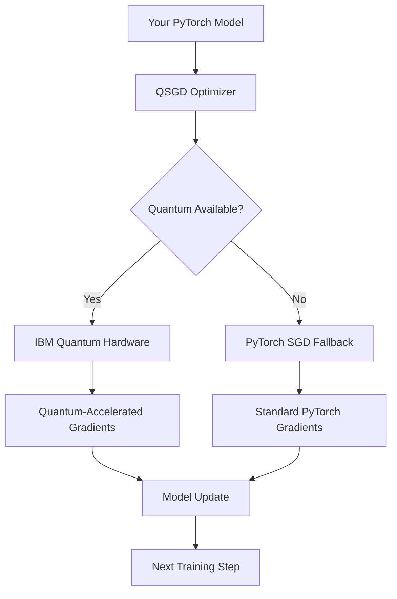

# QSGD: Quantum Stochastic Gradient Descent

**Production-ready quantum-accelerated optimization**

---

## What QSGD Does

QSGD provides **quantum-accelerated stochastic gradient descent** that automatically falls back to **production PyTorch optimizers** when quantum hardware is unavailable or fails. This ensures your ML workflows never break, regardless of quantum backend status.

**Key Benefits:**
- **Zero downtime**: Automatic fallback to trusted PyTorch optimizers
- **Quantum acceleration**: Real IBM Quantum hardware when available
- **Drop-in replacement**: Compatible with existing PyTorch training loops
- **Production ready**: Built-in error handling, logging, and monitoring

---

## How It Works



### Automatic Fallback Behavior

1. **Quantum Mode**: When IBM Quantum credentials are set and hardware is available
2. **Classical Fallback**: When quantum fails, API limits reached, or credentials missing

---

## Installation

```bash
git clone https://github.com/YOUR_USERNAME/qsgd.git
cd qsgd
python -m venv .qsgd-venv

# Windows
.qsgd-venv\Scripts\activate

# macOS/Linux  
source .qsgd-venv/bin/activate

pip install --upgrade pip
pip install torch torchvision torchaudio
pip install qiskit qiskit-ibm-runtime
pip install -e .
```

---

## Quick Start

### Basic Usage (Automatic Fallback)

```python
import torch
from qsgd.optim import SGD_QAE

# Your model
model = torch.nn.Linear(10, 1)
criterion = torch.nn.MSELoss()

# QSGD optimizer - automatically falls back to PyTorch if quantum unavailable
optimizer = SGD_QAE(
    model.parameters(),
    lr=0.01,
    use_quantum=True,  # Will auto-fallback if quantum fails
    backend="auto"      # Automatically detects best available backend
)

# Standard PyTorch training loop
for epoch in range(100):
    optimizer.zero_grad()
    loss = criterion(model(x), y)
    loss.backward()
    optimizer.step()  # Quantum if available, PyTorch if not
```

### Force Classical Mode

```python
# Always use PyTorch (no quantum)
optimizer = SGD_QAE(
    model.parameters(),
    lr=0.01,
    use_quantum=False,  # Forces PyTorch SGD
    backend="sim"        # Simulator mode
)
```

---

## Backend Configuration

### Automatic Detection (Recommended)

```python
optimizer = SGD_QAE(
    model.parameters(),
    backend="auto"  # Automatically selects best available
)
```

**Priority Order:**
1. **IBM Quantum**
2. **PyTorch SGD** 

### Manual Backend Selection

```python
# Force IBM Quantum (requires credentials)
optimizer = SGD_QAE(
    model.parameters(),
    backend="ibm",
    use_quantum=True
)

# Force PyTorch (no quantum)
optimizer = SGD_QAE(
    model.parameters(),
    backend="sim",
    use_quantum=False
)
```

---

## IBM Quantum Setup (Optional)

**Only set up in research/testing environments**

### 1. IBM Cloud Setup
- Create account at [IBM Quantum](https://quantum-computing.ibm.com/)
- Create Quantum Service instance → Get **CRN**
- Generate **API Key** in Service Credentials

### 2. Environment Variables

**Windows (PowerShell):**
```powershell
$env:QISKIT_IBM_TOKEN="YOUR_API_KEY"
$env:QISKIT_IBM_INSTANCE="YOUR_INSTANCE_CRN"
$env:QISKIT_IBM_CHANNEL="ibm_quantum_platform"
```

**macOS/Linux:**
```bash
export QISKIT_IBM_TOKEN="YOUR_API_KEY"
export QISKIT_IBM_INSTANCE="YOUR_INSTANCE_CRN"
export QISKIT_IBM_CHANNEL="ibm_quantum_platform"
```

### 3. Test Quantum Integration

```bash
python test_ibm_quantum_run.py
```


**Result**: Your training continues uninterrupted with production PyTorch optimizers.

---

## Performance Characteristics

### Quantum Mode (IBM Hardware)
- **Gradient estimation**: Quantum amplitude estimation
- **Precision**: Configurable (default: 2% error tolerance)
- **Shots**: Configurable (default: 2000)
- **Latency**: Network + quantum execution time

### Classical Fallback (PyTorch)
- **Gradient estimation**: Standard PyTorch SGD
- **Precision**: Machine precision
- **Latency**: Local computation only
- **Reliability**: Production PyTorch tested

---

## Advanced Configuration

### Custom Oracles

```python
def custom_oracle(batch, params, indices, bounds):
    # Your custom quantum circuit logic
    qc = QuantumCircuit(1)
    qc.h(0)
    observable = SparsePauliOp.from_list([('Z', 1)])
    return qc, observable

optimizer = SGD_QAE(
    model.parameters(),
    build_oracle=custom_oracle,
    backend="ibm"
)
```

### Precision Control

```python
optimizer = SGD_QAE(
    model.parameters(),
    ae_precision=0.01,  # 1% error tolerance
    shots=5000,         # More shots = higher precision
    backend="ibm"
)
```

---

## Monitoring & Logging

QSGD provides comprehensive logging:

```python
from qsgd.log import Logger

# Automatic logging to ./runs/qsgd/
logger = Logger(log_dir="./logs")

# Logs include:
# - Training metrics (loss, gradients)
# - Quantum vs classical mode
# - Fallback events
# - Performance statistics
```

---

## Architecture

```
qsgd/
├── optim/           # Optimizers (SGD_QAE)
├── quantum/         # Quantum backends (IBM, Braket)
├── oracles/         # Quantum circuit builders
├── runtime/         # Orchestration & scheduling
├── log.py          # Structured logging
└── cli/            # Command-line tools
```

---

## Production Deployment

### Development
```python
# Automatic fallback, minimal configuration
optimizer = SGD_QAE(model.parameters(), lr=0.01)
```

### Production
```python
# Explicit configuration, monitoring
optimizer = SGD_QAE(
    model.parameters(),
    lr=0.01,
    backend="auto",
    log_dir="/var/log/qsgd",
    max_retries=3,
    timeout_s=120
)
```

---

## Troubleshooting

### Common Issues

**"Quantum backend unavailable"**
- **Solution**: Automatic fallback to PyTorch - no action needed
- **Check**: Verify IBM credentials if you want quantum acceleration

**"Training seems slower"**
- **Cause**: Falled back to PyTorch (quantum unavailable)
- **Solution**: Check IBM Quantum status or continue with PyTorch

**"Import errors"**
- **Solution**: Install required packages: `pip install torch qiskit`

### Health Check

```bash
# Check environment and dependencies
python -m qsgd.cli.doctor

# List available backends
python -m qsgd.cli.providers
```

---

## License

Apache 2.0 License

---

## Citation

```bibtex
@software{qsgd2025,
  title={qhaven-QSGD: Quantum Stochastic Gradient Descent},
  author={cadengreen},
  year={2025},
  url={https://github.com/breezynotcheezy/qhaven-qsgd}
}
```
